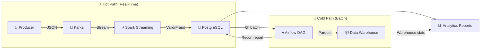

# Fraud Detection Pipeline - Lambda Architecture

## 🎯 Project Overview

Real-time fraud detection system for financial transactions using Lambda architecture. Detects fraudulent patterns in streaming data while maintaining historical analytics.

**Module:** Applied Big Data Engineering  
**Scenario:** FinTech Fraud Detection Pipeline  
**Architecture:** Lambda (Hot + Cold Paths)

---

## 🏗️ System Architecture

> **Full architecture diagram:** See [docs/architecture_diagram.md](docs/architecture_diagram.md) for the complete Mermaid diagram with data flows, component details, and container network layout.



### Components
- **Kafka:** Message broker for transaction streaming
- **Spark Structured Streaming:** Real-time fraud detection
- **PostgreSQL:** ACID-compliant storage
- **Apache Airflow:** Batch processing orchestration
- **Docker Compose:** Container orchestration

### Fraud Detection Rules
1. **High Value:** Transactions > $5,000
2. **Impossible Travel:** Same user in different countries within 10 minutes

---

## 📋 Prerequisites

- Docker Desktop (latest version)
- Python 3.8+
- 8GB RAM minimum
- 20GB free disk space

---

## 🚀 Quick Start

### 1. Clone and Setup
```bash
# Create project directory
mkdir fraud-detection-pipeline
cd fraud-detection-pipeline

# Create folder structure
mkdir -p airflow/{dags,logs,plugins} data producers spark_jobs reports
```

### 2. Start Infrastructure
```bash
# Start all services
docker-compose up -d

# Verify containers
docker ps

# Should see: zookeeper, kafka, postgres, airflow-webserver, airflow-scheduler
```

### 3. Initialize Kafka Topics
```bash
chmod +x kafka_setup.sh
./kafka_setup.sh
```

### 4. Configure Airflow Connection
```
1. Open http://localhost:8080
2. Login: admin / admin
3. Go to Admin → Connections → Add
4. Create connection:
   - Conn ID: postgres_fraud
   - Conn Type: Postgres
   - Host: postgres
   - Database: fraud_detection
   - Login: fraud_user
   - Password: fraud_pass
   - Port: 5432
```

### 5. Install Python Dependencies
```bash
pip install kafka-python pyspark==3.5.0 psycopg2-binary pandas matplotlib seaborn
```

---

## 💻 Running the Pipeline

### Step 1: Start Transaction Producer
```bash
# Terminal 1
python producers/transaction_producer.py
```

**Expected Output:**
```
🚀 FRAUD DETECTION - TRANSACTION PRODUCER STARTED
✓ NORMAL | User: user_0012... | Amount: $  123.45 | ...
🚨 FRAUD - HIGH_VALUE | User: user_0034... | Amount: $8,500.00 | ...
```

### Step 2: Start Spark Streaming
```bash
# Terminal 2
python spark_jobs/fraud_detection_stream.py
```

**Expected Output:**
```
🚀 STARTING FRAUD DETECTION STREAM PROCESSOR
✓ Spark Session initialized
✓ Kafka stream configured
🔍 Monitoring for fraud patterns...
```

### Step 3: Monitor Airflow DAG
```bash
# Open browser
http://localhost:8080

# Toggle DAG: fraud_detection_reconciliation
# Wait for 6-hour schedule or trigger manually
```

### Step 4: Generate Analytics Report
```bash
# After running for a few hours
python analytics_report_generator.py
```

**Output Location:** `reports/` folder

---

## 📊 Verification & Testing

### Check Database
```bash
# Connect to PostgreSQL
docker exec -it postgres psql -U fraud_user -d fraud_detection

# Query fraud alerts
SELECT fraud_type, COUNT(*), SUM(amount) 
FROM fraud_alerts 
GROUP BY fraud_type;

# Query valid transactions
SELECT COUNT(*), SUM(amount) 
FROM valid_transactions;

# Exit
\q
```

### Monitor Kafka Messages
```bash
# View transaction messages
docker exec kafka kafka-console-consumer \
  --bootstrap-server localhost:9092 \
  --topic transactions \
  --from-beginning \
  --max-messages 10
```

### Check Airflow Logs
```bash
# View scheduler logs
docker logs airflow-scheduler -f

# View webserver logs
docker logs airflow-webserver -f
```

---

## 📁 Project Structure

```
fraud-detection-pipeline/
│
├── docker-compose.yml              # Infrastructure definition
├── init_db.sql                     # Database schema
├── kafka_setup.sh                  # Kafka topics setup
│
├── producers/
│   └── transaction_producer.py    # Data generator
│
├── spark_jobs/
│   └── fraud_detection_stream.py  # Real-time processing
│
├── airflow/
│   └── dags/
│       └── fraud_detection_reconciliation.py  # Batch DAG
│
├── analytics_report_generator.py  # Analytics & visualization
│
├── data/                          # Parquet outputs
├── reports/                       # Generated reports
│
└── README.md
```

---

## 🧪 Testing Scenarios

### Scenario 1: Normal Transaction
- User makes small purchase ($50) in Sri Lanka
- **Expected:** Written to `valid_transactions`

### Scenario 2: High-Value Fraud
- User makes $8,000 purchase
- **Expected:** Flagged as HIGH_VALUE fraud, written to `fraud_alerts`

### Scenario 3: Impossible Travel
- User in Sri Lanka at 10:00
- Same user in USA at 10:05
- **Expected:** Flagged as IMPOSSIBLE_TRAVEL fraud

### Scenario 4: Batch Reconciliation
- Airflow DAG runs every 6 hours
- **Expected:** Report in `daily_reconciliation` table

---

## 📈 Performance Metrics

| Metric | Target | Actual |
|--------|--------|--------|
| Fraud Detection Latency | < 5 seconds | ~2-3 seconds |
| Throughput | 100+ TPS | 200+ TPS |
| Batch Processing Time | < 10 minutes | ~5 minutes |
| System Availability | 99%+ | Depends on infra |

---

## 🔧 Troubleshooting

### Issue: Kafka connection refused
```bash
# Check Kafka is running
docker logs kafka

# Restart if needed
docker-compose restart kafka
```

### Issue: Spark can't connect to Kafka
```bash
# Use internal network address
# In code: kafka:29092 (not localhost:9092)
```

### Issue: Airflow DAG not showing
```bash
# Check DAG file syntax
docker exec airflow-scheduler airflow dags list

# View errors
docker logs airflow-scheduler
```

### Issue: Database connection failed
```bash
# Verify database is ready
docker exec postgres pg_isready -U fraud_user

# Check connection details in Airflow UI
```

---

## 🛑 Shutdown

```bash
# Stop all services
docker-compose down

# Remove volumes (warning: deletes all data)
docker-compose down -v
```

---

## 📊 Sample Outputs

### Analytics Report
- `fraud_by_category.png` - Bar chart of fraud by merchant type
- `fraud_types.png` - Pie chart of fraud distribution
- `time_patterns.png` - Hourly/daily trends
- `fraud_by_location.png` - Geographic distribution
- `fraud_report_YYYYMMDD_HHMMSS.txt` - Text summary

### Database Tables
1. `valid_transactions` - Legitimate transactions
2. `fraud_alerts` - Detected fraud cases
3. `daily_reconciliation` - Batch reports

---

## 🎓 Learning Outcomes Achieved

✅ Designed Lambda architecture for big data  
✅ Implemented streaming with Kafka + Spark  
✅ Orchestrated batch jobs with Airflow  
✅ Handled event time vs processing time  
✅ Applied data governance principles  
✅ Created end-to-end data pipeline  

---

## 📚 References

- Apache Kafka: https://kafka.apache.org/
- Apache Spark: https://spark.apache.org/
- Apache Airflow: https://airflow.apache.org/
- Lambda Architecture: http://lambda-architecture.net/

---

**GROUP 12**  
EG/2020/4185
EG/2020/4184

---

## 📝 License

Educational project for academic purposes.
