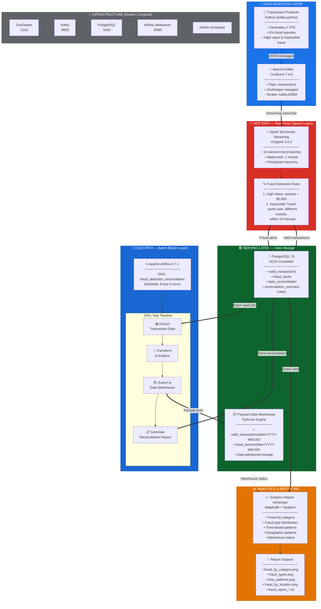

# 🏗️ System Architecture Diagram

## FinTech Fraud Detection Pipeline — Lambda Architecture



---

## 📐 Data Flow Summary

| Path | Flow | Latency |
|------|------|---------|
| **Hot Path** | Producer → Kafka → Spark Streaming → PostgreSQL | ~2-3 seconds |
| **Cold Path** | PostgreSQL → Airflow ETL → Parquet Warehouse → Reconciliation Report | Every 6 hours |
| **Analytics** | PostgreSQL + Parquet → Report Generator → PNG/TXT reports | On-demand |

---

## 🔄 Lambda Architecture Layers

### Speed Layer (Hot Path)
- **Purpose:** Real-time fraud detection with sub-second latency
- **Technology:** Kafka + Spark Structured Streaming
- **Output:** Immediate writes to `valid_transactions` and `fraud_alerts` tables

### Batch Layer (Cold Path)
- **Purpose:** Comprehensive reconciliation and archival
- **Technology:** Apache Airflow orchestrating 4-task ETL DAG
- **Output:** Date-partitioned Parquet warehouse + reconciliation reports in PostgreSQL

### Serving Layer
- **Purpose:** Unified query interface for both real-time and batch results
- **Technology:** PostgreSQL (structured data) + Parquet files (columnar warehouse)
- **Consumers:** Analytics Report Generator, Airflow DAG, direct SQL queries

---

## 🐳 Container Network

All services communicate over `fraud-detection-network` (Docker bridge):

```
┌──────────────────────────────────────────────────────────────┐
│                   fraud-detection-network                    │
│                                                              │
│  ┌───────────┐   ┌──────────┐   ┌──────────────────────┐   │
│  │ ZooKeeper │◄──│  Kafka   │   │     PostgreSQL       │   │
│  │   :2181   │   │  :9092   │   │       :5432          │   │
│  └───────────┘   │  :29092  │   └──────────────────────┘   │
│                  └──────────┘            ▲                   │
│                       ▲                 │                    │
│                       │           ┌─────┴──────────────┐    │
│              ┌────────┘           │  Airflow Webserver  │   │
│              │                    │       :8080         │   │
│     ┌────────┴────────┐          └─────────────────────┘    │
│     │ Spark Streaming │          ┌─────────────────────┐    │
│     │   (external)    │          │  Airflow Scheduler   │   │
│     └─────────────────┘          └─────────────────────┘    │
│                                                              │
│     ┌─────────────────┐                                     │
│     │   Transaction   │          ./data/warehouse/          │
│     │    Producer     │          ├── valid_transactions/     │
│     │   (external)    │          │   └── date=YYYY-MM-DD/   │
│     └─────────────────┘          └── fraud_archive/         │
│                                      └── date=YYYY-MM-DD/   │
└──────────────────────────────────────────────────────────────┘
```
